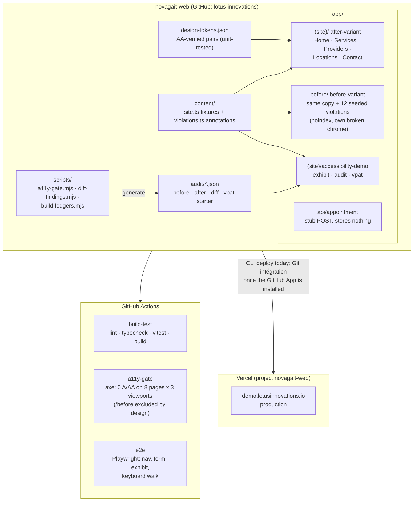

# Architecture

One Next.js (App Router) application serving two variants of the same
fictional clinic site plus the exhibit layer that compares them.

## Data flow

- All content is synthetic fixtures in `content/site.ts`; both variants
  render the same copy, which is what makes the before/after comparison
  honest.
- The audit pages render the committed ledgers in `audit/` directly (JSON
  imports at build time). Ledgers are regenerated by
  `scripts/build-ledgers.mjs` from Stage A scans (`audit-work/`, untracked)
  plus the manual findings defined in that script; an attribution tripwire
  throws if any scan finding fails to map to a seeded violation.
- The appointment endpoint validates shape and returns a reference code;
  nothing is stored anywhere (stated in the UI).

## Deploy path

- Production: Vercel CLI with token (same pattern as lotusinnovations.io)
  until the Vercel GitHub App is installed for the `lotus-innovations` org,
  at which point PR preview deploys activate with no other changes
  (tracked in issue #10).
- DNS: Cloudflare CNAME `demo` -> `cname.vercel-dns.com` (zone
  lotusinnovations.io).

## Theming

Tokens land as CSS custom properties in `globals.css`; light is default,
dark applies via `prefers-color-scheme` or the header selector
(`data-theme` on `<html>`, persisted in localStorage, applied pre-paint by
an inline script). The before-variant opts out of theming entirely
(hard-coded light palette), which keeps its seeded contrast values stable.
